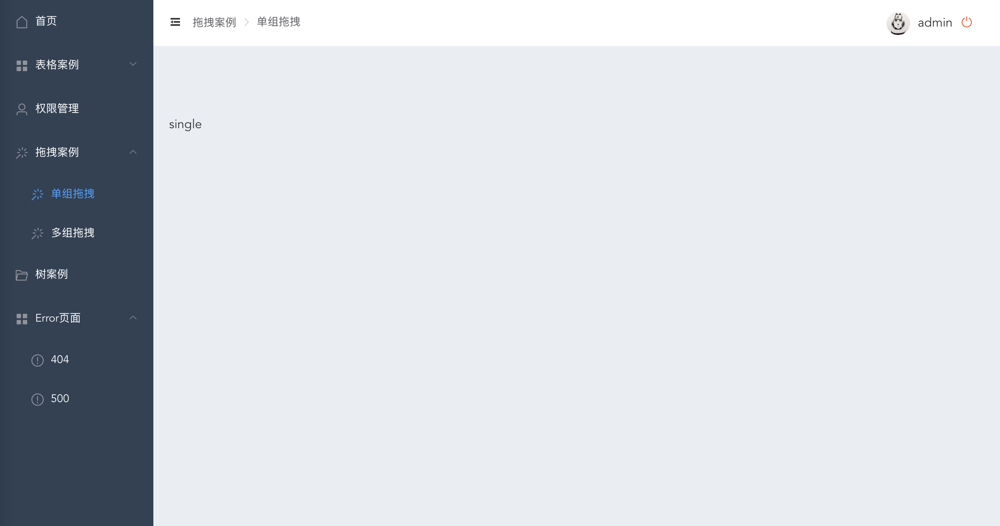
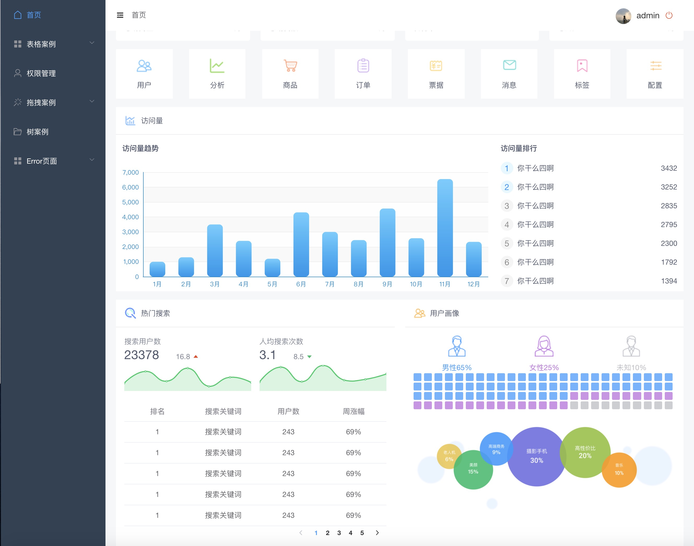

# active-router

## Project setup
```
npm install
```

### Compiles and hot-reloads for development
```
npm run serve
```

### Compiles and minifies for production
```
npm run build
```

### Run your tests
```
npm run test
```

### Lints and fixes files
```
npm run lint
```

### Customize configuration
See [Configuration Reference](https://cli.vuejs.org/config/).


### introduction

---

- #### `vue` `vue-axios` `vue-router` `vuex` `echarts` `element-ui` `mockjs` 

- #### 根据权限动态设置路由

- #### 根据路由动态渲染面包屑

  

- #### 仿ivew-admin-pro首页

  

